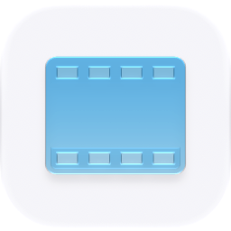
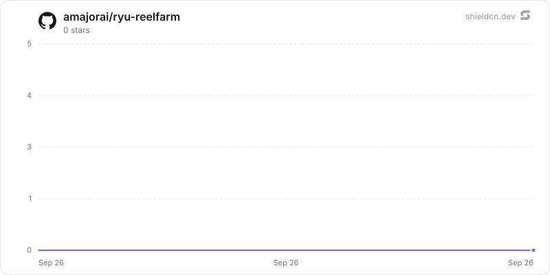

<p align="center">
  <picture>
    <source media="(prefers-color-scheme: dark)" srcset="./icon-dark.png" />
    
  </picture>
</p>

<div align="center">

# Studio

</div>

A local-first short-form publishing queue for ideas, hooks, visual direction, and scheduled release slots.

> **The public home of `ryu-reelfarm`.** Source, builds, and releases live here —
> binaries for every platform are attached to each release.
>
> This tree is generated from the Ryu monorepo, so commits pushed here
> directly are replaced on the next sync. **Pull requests are welcome** —
> open them here and they are ported into the monorepo, then flow back out.
> Ryu as a whole: https://github.com/amajorai/ryu

## Install

**App:** [Install](ryu://apps/@ryu/studio) (opens the Ryu desktop app and asks you to confirm)

**CLI:**

```bash
ryu apps add @ryu/studio
```

## Source & build

This is the **source of record** for the app UI. It imports Ryu's private
`@ryu/ui` design system, so it does **not** build standalone outside the
monorepo — it **builds inside the amajorai/ryu monorepo workspace**.
The shipped bundle is the built artifact, produced by the monorepo build.

## License

Apache-2.0 — see [LICENSE](./LICENSE).

## Build and test

```sh
rtk bun run --cwd apps-store/reelfarm/ui test
rtk bun run --cwd apps-store/reelfarm/ui check-types
rtk bun run --cwd apps-store/reelfarm/ui build
```

The UI build emits one self-contained `dist/index.html` for the sandboxed
Companion host.

## Star History

<a href="https://github.com/amajorai/ryu-reelfarm/stargazers">
  <picture>
    <source media="(prefers-color-scheme: dark)" srcset="./.github/shieldcn/star-chart-dark.svg" />
    
  </picture>
</a>
